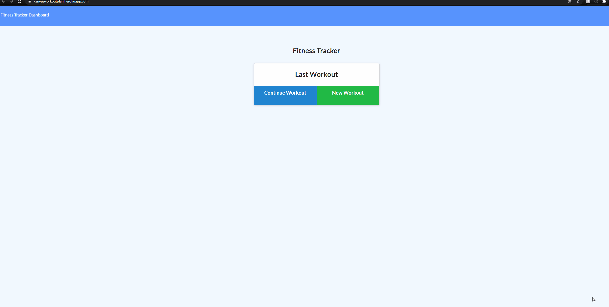

# Kanyes Workout Plan
 

 
### Table of Contents:
* [User Story](##-User-Story)
* [Description](##-Description)
* [Installation](##-Installation)
* [Credits](##-Credits)
* [Contributors](##-Contributors)
* [License](##-License)
 
## Deployed site
[Kanyes Workout Plan](https://kanyesworkoutplan.herokuapp.com/)

 
## User Story
AS A workout enthusiast I need an app that can track my exercise routines.
 
## Description
A site used to track workout information. 
 
## Installation
To run locally Install dependencies and run on node.
 
## Contributors
Efrain Nevarez
 
## Credits
NODEJS, MONGOOSE, HTML, CSS, Node, Express, Heroku, JavaScript
 
## License
This project is licensed by MIT